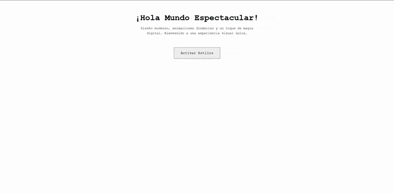

# ¡Hola Mundo Espectacular! ✨ | Por Amós

Una versión moderna, interactiva y visualmente impactante del clásico "Hola Mundo". Este proyecto transforma una simple página HTML en una experiencia digital con efectos neón, partículas 3D, animaciones, galerías y un toque de creatividad.



---

## 🚀 Descripción General

Esta landing page va más allá de un saludo tradicional. Incorpora técnicas modernas de desarrollo web para crear una experiencia memorable y dinámica:

- **Diseño oscuro y neón** con estética futurista.
- **Fondo animado de partículas 3D** usando Three.js, que reacciona al movimiento del cursor.
- **Animaciones de texto** (glitch, aparición secuencial, efectos sutiles).
- **Galería de imágenes** y **galería de cómic** en modales interactivos.
- **Animación especial**: al hacer clic en "Descubre más", una nave cruza la pantalla.
- **Modo básico/minimalista** al cargar, que se transforma en la versión completa al pulsar "Activar Estilos".

---

## ✨ Características Principales

- **HTML5 Semántico**: Estructura clara y accesible.
- **CSS3 Avanzado**:
  - Diseño Mobile-First y responsive.
  - Variables CSS para tematización sencilla.
  - Flexbox para layout flexible.
  - Efecto neón con `text-shadow`.
  - Glassmorphism en header/footer con `backdrop-filter`.
  - Animaciones CSS para texto, gradientes y elementos interactivos.
  - Transiciones suaves en interacciones.
- **JavaScript Moderno**:
  - Fondo de partículas 3D con Three.js.
  - Menú hamburguesa para navegación móvil.
  - Efecto glitch en el título y animaciones de subtítulo.
  - Galerías modales de imágenes y cómic, con navegación.
  - Animación de nave espacial al pulsar "Descubre más".
  - Activación dinámica de estilos avanzados.
- **Fuentes e Iconos**:
  - Google Fonts (Orbitron, Roboto Mono).
  - Font Awesome para iconos.

---

## 🖼️ Galerías Interactivas

- **Galería de Imágenes**: Accesible desde el botón "Ver Imagen". Permite navegar entre decenas de imágenes con controles.
- **Galería de Cómic**: Accesible desde el botón "Comic Estelar". Visualiza una secuencia de viñetas tipo cómic.

Ambas galerías se muestran en modales superpuestos y son navegables con botones de anterior/siguiente.

---

## ⚡ ¿Cómo Ejecutarlo?

1. Clona o descarga este repositorio:
   ```bash
   git clone [URL de tu repositorio]
   ```
   O descarga el archivo ZIP.
2. Navega a la carpeta del proyecto.
3. Abre el archivo `index.html` en tu navegador web preferido (se recomienda uno moderno compatible con WebGL).
4. Al cargar, verás la versión básica. Pulsa **"Activar Estilos"** para desbloquear la experiencia completa.
5. Explora las galerías y animaciones usando los botones de la página.

---

## 📁 Estructura del Proyecto

```bash
├── index.html         # Archivo principal HTML
├── style.css          # Estilos CSS
├── script.js          # Lógica JavaScript
├── assets/
│   ├── demo.gif       # Demo animado
│   ├── comic/         # Imágenes del cómic
│   └── images/        # Imágenes de la galería
└── README.md          # Este archivo
```

---

## 💻 Tecnologías Utilizadas

- **HTML5**
- **CSS3** (Variables, Flexbox, Animaciones, Media Queries, Glassmorphism)
- **JavaScript** (ES6+, DOM, Eventos)
- [Three.js](https://threejs.org/) (gráficos 3D/WebGL)
- [Font Awesome](https://fontawesome.com/) (iconos)
- [Google Fonts](https://fonts.google.com/)

---

## 🙏 Créditos

Ejercicio realizado por: **Amós**

---

## 📄 Licencia

Este proyecto se distribuye bajo la Licencia MIT. Consulta el archivo `LICENSE` para más detalles.
